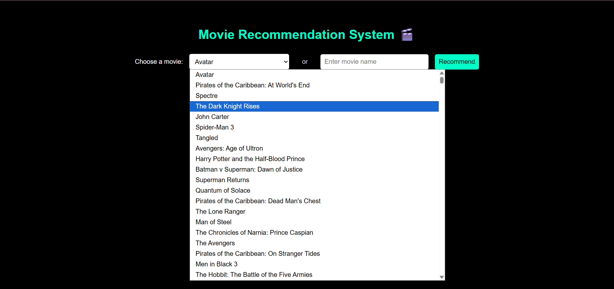
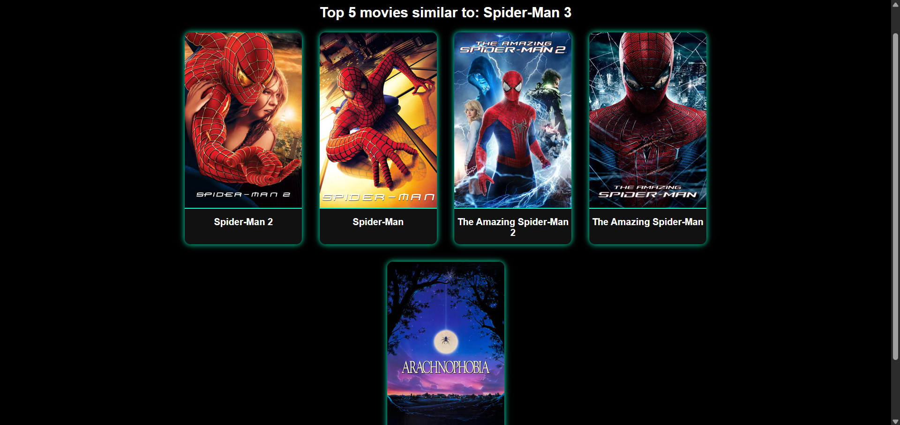

# 🎬 Movie Recommendation System

A **Content-Based Movie Recommendation System** built using Flask, Machine Learning (NLP), and the TMDB API.  
It recommends movies based on your input—either from a dropdown or a manually entered title—and displays real posters and titles of the top 5 similar movies.

---

## 📌 Project Features

- ✅ Select or enter a movie name
- ✅ Recommend top 5 similar movies
- ✅ Fetch posters using TMDB API
- ✅ Content-based filtering using NLP
- ✅ Web app with HTML + CSS + Flask

---

## 📂 Dataset Source

This project uses the **TMDB 5000 Movie Dataset** from Kaggle:

📎 **Link:** [TMDB 5000 Movie Dataset on Kaggle](https://www.kaggle.com/datasets/tmdb/tmdb-movie-metadata)

The dataset includes:
- `tmdb_5000_movies.csv`
- `tmdb_5000_credits.csv`

---

## 🖼️ Output Screenshots

### 🔍 Movie Selection Form:

### 🎯 Recommended Results:

---

## 🧠 ML Concepts Used

- Data Cleaning using Pandas & ast
- Feature Engineering (Genres, Cast, Crew, Keywords, Overview)
- NLP Preprocessing (Tokenization, Lowercasing, Stemming)
- Vectorization with **CountVectorizer**
- Similarity computation using **Cosine Similarity**

---

